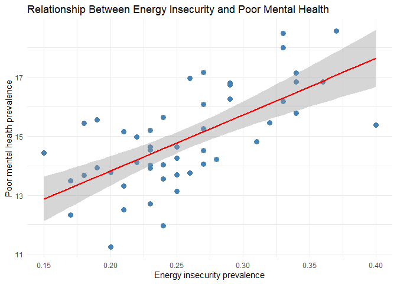
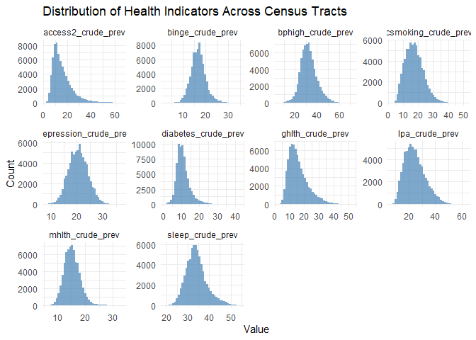
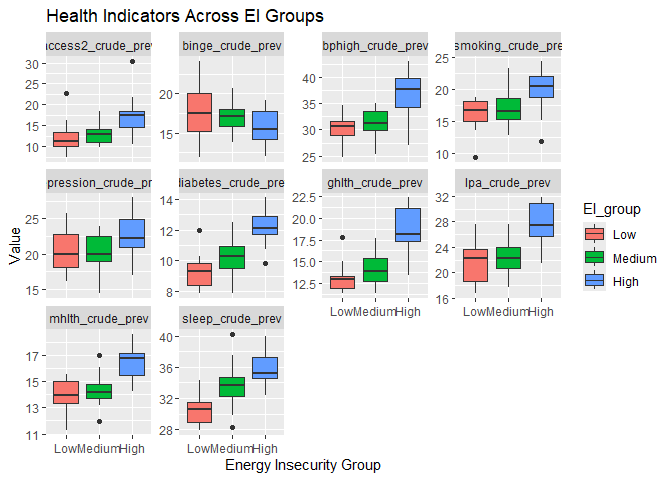

EDA
================

- [EDA for Household Energy
  Insecurity](#eda-for-household-energy-insecurity)
- [EDA for Census](#eda-for-census)
- [EDA for Census and Household Energy
  Insecurity](#eda-for-census-and-household-energy-insecurity)
- [EDA for other health related
  variables](#eda-for-other-health-related-variables)

# EDA for Household Energy Insecurity

First, I calculated the average and range of both EI and PO proportions
across all 50 states plus the District of Columbia. The average level of
energy insecurity (EI) is about 0.256, with values ranging from
0.15–0.4. For power outage proportion (PO), the average is roughly
0.182, and the range spans from 0.04–0.6.

The distribution plots are shown below.
<!-- --><!-- -->

Both distributions are right-skewed and do not appear to be multimodal.
This suggests that most states fall within the low-to-moderate range of
EI or PO, while a small number of states experience disproportionately
high levels of energy insecurity or power outages.

To examine whether the two variables are related, I also put them
together. The plot for both is below.
<!-- -->

I have also computed the ranks of EI and PO for each state, the results
are shown in the table below.

| state                | EI_rank | PO_rank |
|:---------------------|--------:|--------:|
| Mississippi          |       1 |       5 |
| West Virginia        |       2 |       9 |
| Arkansas             |       3 |      12 |
| Alabama              |       4 |       6 |
| Oklahoma             |       4 |       5 |
| Texas                |       4 |      11 |
| Georgia              |       5 |       7 |
| Kentucky             |       5 |      18 |
| Louisiana            |       5 |       1 |
| South Carolina       |       6 |      13 |
| California           |       7 |      14 |
| Indiana              |       8 |      12 |
| Michigan             |       8 |       8 |
| Nevada               |       8 |      24 |
| New York             |       9 |      14 |
| Arizona              |      10 |      26 |
| Connecticut          |      10 |       2 |
| Missouri             |      10 |      18 |
| North Carolina       |      10 |      11 |
| Tennessee            |      10 |      15 |
| Delaware             |      11 |      17 |
| Ohio                 |      11 |      17 |
| Alaska               |      12 |      22 |
| Kansas               |      12 |      20 |
| New Jersey           |      12 |       4 |
| New Mexico           |      12 |      21 |
| Virginia             |      12 |      14 |
| Colorado             |      13 |      23 |
| Hawaii               |      13 |      27 |
| Montana              |      13 |      19 |
| Pennsylvania         |      13 |      14 |
| Florida              |      14 |      16 |
| Illinois             |      14 |      18 |
| Maine                |      14 |       2 |
| Maryland             |      14 |      23 |
| New Hampshire        |      14 |      11 |
| Rhode Island         |      14 |      10 |
| Massachusetts        |      15 |      16 |
| Washington           |      15 |      13 |
| North Dakota         |      16 |      25 |
| Oregon               |      16 |      14 |
| Wyoming              |      16 |      19 |
| South Dakota         |      17 |      24 |
| Wisconsin            |      17 |      21 |
| Idaho                |      18 |      18 |
| Utah                 |      18 |      15 |
| District of Columbia |      19 |      24 |
| Iowa                 |      19 |       3 |
| Minnesota            |      20 |      23 |
| Nebraska             |      20 |      22 |
| Vermont              |      21 |      19 |

Ranks of EI and PO by State

There are 51 states in total, but many states share the same EI or PO
proportion, so we end up with only 21 unique EI ranks and 24 PO ranks.

I expected those with high PO rank will also have high EI rank, but the
results above don’t really show a clear pattern. So, I run a simple
linear regression.

    ## 
    ## Call:
    ## lm(formula = EI_proportion ~ PO_proportion, data = RECS_EI)
    ## 
    ## Residuals:
    ##       Min        1Q    Median        3Q       Max 
    ## -0.115524 -0.035730 -0.004147  0.028972  0.117642 
    ## 
    ## Coefficients:
    ##               Estimate Std. Error t value Pr(>|t|)    
    ## (Intercept)    0.22217    0.01386  16.032  < 2e-16 ***
    ## PO_proportion  0.18807    0.06424   2.928  0.00517 ** 
    ## ---
    ## Signif. codes:  0 '***' 0.001 '**' 0.01 '*' 0.05 '.' 0.1 ' ' 1
    ## 
    ## Residual standard error: 0.05288 on 49 degrees of freedom
    ## Multiple R-squared:  0.1489, Adjusted R-squared:  0.1315 
    ## F-statistic: 8.571 on 1 and 49 DF,  p-value: 0.005167

<!-- -->

The results indicate a statistically significant but weak positive
association: the slope is positive, meaning states with higher outage
proportions tend to have slightly higher levels of energy insecurity,
but the effect size is small. The model’s R² is only about 0.149,
showing that PO explains a relatively small share of the variation in EI
across states.

Overall, this analysis suggests that while PO and EI are positively
related, outages are unlikely to be the primary driver of state-level
energy insecurity. Other structural and socioeconomic factors—such as
income, housing conditions, or energy costs—likely play a much larger
role in shaping EI outcomes.

# EDA for Census

Our research focuses on mental health, so I first examined the
distributions of poor mental health and depression prevalence across
census tracts. Both distributions are slightly skewed to the right and
unimodal. The average prevalence of poor mental health is 15.17, ranging
from 6.1–33%. Depression shows a similar pattern, with an average
prevalence of 20.545 and a range of 8.5–36.8%.
<!-- --><!-- -->

Next, I aggregated the census-tract data to the state level by averaging
mental health measures across counties.

| state_desc           | mean_mhlth | mean_depression | mhlth_rank | depression_rank |
|:---------------------|-----------:|----------------:|-----------:|----------------:|
| West Virginia        |     18.576 |          27.962 |          1 |               1 |
| Kentucky             |     18.496 |          25.883 |          2 |               2 |
| Louisiana            |     18.009 |          24.939 |          3 |               6 |
| Tennessee            |     17.160 |          25.815 |          4 |               3 |
| Oklahoma             |     17.142 |          24.437 |          5 |               8 |
| Ohio                 |     16.963 |          23.841 |          6 |              11 |
| Alabama              |     16.835 |          25.045 |          7 |               5 |
| Arkansas             |     16.834 |          24.413 |          8 |               9 |
| Michigan             |     16.810 |          20.984 |          9 |              25 |
| Nevada               |     16.737 |          19.651 |         10 |              34 |
| Indiana              |     16.255 |          23.335 |         11 |              14 |
| Georgia              |     16.175 |          19.749 |         12 |              32 |
| Missouri             |     16.088 |          23.551 |         13 |              12 |
| Texas                |     15.772 |          21.325 |         14 |              24 |
| Pennsylvania         |     15.632 |          21.767 |         15 |              22 |
| Utah                 |     15.563 |          24.607 |         16 |               7 |
| South Carolina       |     15.469 |          22.231 |         17 |              20 |
| District of Columbia |     15.437 |          20.138 |         18 |              26 |
| Mississippi          |     15.384 |          21.379 |         19 |              23 |
| Arizona              |     15.258 |          20.002 |         20 |              27 |
| Florida              |     15.200 |          18.247 |         21 |              40 |
| Oregon               |     15.162 |          22.823 |         22 |              17 |
| Washington           |     14.971 |          25.681 |         23 |               4 |
| California           |     14.821 |          17.002 |         24 |              47 |
| New Mexico           |     14.639 |          19.653 |         25 |              33 |
| New Hampshire        |     14.636 |          22.253 |         26 |              19 |
| Rhode Island         |     14.540 |          22.933 |         27 |              16 |
| North Carolina       |     14.518 |          22.204 |         28 |              21 |
| Vermont              |     14.443 |          24.283 |         29 |              10 |
| Kansas               |     14.248 |          19.389 |         30 |              35 |
| New York             |     14.206 |          18.412 |         31 |              39 |
| Massachusetts        |     14.115 |          19.290 |         32 |              37 |
| Connecticut          |     14.054 |          19.937 |         33 |              29 |
| Colorado             |     14.030 |          19.903 |         34 |              31 |
| Maine                |     14.025 |          23.398 |         35 |              13 |
| Idaho                |     13.937 |          19.936 |         36 |              30 |
| Maryland             |     13.920 |          17.754 |         37 |              44 |
| Wisconsin            |     13.775 |          19.977 |         38 |              28 |
| Delaware             |     13.748 |          17.729 |         39 |              45 |
| Virginia             |     13.702 |          19.364 |         40 |              36 |
| Iowa                 |     13.684 |          17.918 |         41 |              42 |
| Montana              |     13.564 |          23.081 |         42 |              15 |
| Minnesota            |     13.504 |          22.279 |         43 |              18 |
| Wyoming              |     13.312 |          18.116 |         44 |              41 |
| Alaska               |     13.142 |          17.716 |         45 |              46 |
| Illinois             |     12.721 |          16.107 |         46 |              48 |
| North Dakota         |     12.505 |          18.870 |         47 |              38 |
| Nebraska             |     12.322 |          17.812 |         48 |              43 |
| Hawaii               |     11.968 |          14.347 |         49 |              50 |
| South Dakota         |     11.255 |          16.099 |         50 |              49 |

State-Level Averages and Rankings for Mental Health Outcomes

The census dataset includes 50 states, resulting in 50 unique ranks for
poor mental health and 50 unique ranks for depression.

I did not examine the relationship between depression and poor mental
health, because their association is already well established and
clearly reflected in the data. Instead, I am more interested in how
mental health outcomes relate to energy insecurity.

# EDA for Census and Household Energy Insecurity

I first compared the state-level ranks, and the results are shown in the
table below.

| state                | EI_rank | PO_rank | mhlth_rank | depression_rank |
|:---------------------|--------:|--------:|-----------:|----------------:|
| Mississippi          |       1 |       5 |         19 |              23 |
| West Virginia        |       2 |       9 |          1 |               1 |
| Arkansas             |       3 |      12 |          8 |               9 |
| Alabama              |       4 |       6 |          7 |               5 |
| Oklahoma             |       4 |       5 |          5 |               8 |
| Texas                |       4 |      11 |         14 |              24 |
| Georgia              |       5 |       7 |         12 |              32 |
| Kentucky             |       5 |      18 |          2 |               2 |
| Louisiana            |       5 |       1 |          3 |               6 |
| South Carolina       |       6 |      13 |         17 |              20 |
| California           |       7 |      14 |         24 |              47 |
| Indiana              |       8 |      12 |         11 |              14 |
| Michigan             |       8 |       8 |          9 |              25 |
| Nevada               |       8 |      24 |         10 |              34 |
| New York             |       9 |      14 |         31 |              39 |
| Arizona              |      10 |      26 |         20 |              27 |
| Connecticut          |      10 |       2 |         33 |              29 |
| Missouri             |      10 |      18 |         13 |              12 |
| North Carolina       |      10 |      11 |         28 |              21 |
| Tennessee            |      10 |      15 |          4 |               3 |
| Delaware             |      11 |      17 |         39 |              45 |
| Ohio                 |      11 |      17 |          6 |              11 |
| Alaska               |      12 |      22 |         45 |              46 |
| Kansas               |      12 |      20 |         30 |              35 |
| New Jersey           |      12 |       4 |         NA |              NA |
| New Mexico           |      12 |      21 |         25 |              33 |
| Virginia             |      12 |      14 |         40 |              36 |
| Colorado             |      13 |      23 |         34 |              31 |
| Hawaii               |      13 |      27 |         49 |              50 |
| Montana              |      13 |      19 |         42 |              15 |
| Pennsylvania         |      13 |      14 |         15 |              22 |
| Florida              |      14 |      16 |         21 |              40 |
| Illinois             |      14 |      18 |         46 |              48 |
| Maine                |      14 |       2 |         35 |              13 |
| Maryland             |      14 |      23 |         37 |              44 |
| New Hampshire        |      14 |      11 |         26 |              19 |
| Rhode Island         |      14 |      10 |         27 |              16 |
| Massachusetts        |      15 |      16 |         32 |              37 |
| Washington           |      15 |      13 |         23 |               4 |
| North Dakota         |      16 |      25 |         47 |              38 |
| Oregon               |      16 |      14 |         22 |              17 |
| Wyoming              |      16 |      19 |         44 |              41 |
| South Dakota         |      17 |      24 |         50 |              49 |
| Wisconsin            |      17 |      21 |         38 |              28 |
| Idaho                |      18 |      18 |         36 |              30 |
| Utah                 |      18 |      15 |         16 |               7 |
| District of Columbia |      19 |      24 |         18 |              26 |
| Iowa                 |      19 |       3 |         41 |              42 |
| Minnesota            |      20 |      23 |         43 |              18 |
| Nebraska             |      20 |      22 |         48 |              43 |
| Vermont              |      21 |      19 |         29 |              10 |

State-Level Ranks of EI, PO, Poor Mental Health, and Depression

New Jersey is not included in the census data, likely due to small
sample size or CDC’s small-area suppression rules. As a result, we can
only see its energy insecurity data in the table, but not its mental
health estimates.

Since the table alone is not easy to interpret visually, I created an
additional scatterplot using the poor mental health rank and EI rank for
each state. (New Jersey does not appear in the plot because its mental
health data is missing.)

    ## `geom_smooth()` using formula = 'y ~ x'

<!-- -->

The relationship between EI rank and poor mental health rank has some
degree of association in the scatterplot. States with higher energy
insecurity tend to also have worse mental health outcomes.

To examine this relationship further, I conducted a simple linear
regression using the proportions of energy insecurity and poor mental
health, instead of their ranks.

    ## 
    ## Call:
    ## lm(formula = mean_mhlth ~ EI_proportion, data = ei_mh_prop_clean)
    ## 
    ## Residuals:
    ##      Min       1Q   Median       3Q      Max 
    ## -2.62099 -0.88085 -0.04676  0.89633  2.19290 
    ## 
    ## Coefficients:
    ##               Estimate Std. Error t value Pr(>|t|)    
    ## (Intercept)    10.0167     0.8161  12.274  < 2e-16 ***
    ## EI_proportion  19.0512     3.1055   6.135 1.56e-07 ***
    ## ---
    ## Signif. codes:  0 '***' 0.001 '**' 0.01 '*' 0.05 '.' 0.1 ' ' 1
    ## 
    ## Residual standard error: 1.246 on 48 degrees of freedom
    ## Multiple R-squared:  0.4395, Adjusted R-squared:  0.4278 
    ## F-statistic: 37.63 on 1 and 48 DF,  p-value: 1.561e-07

    ## `geom_smooth()` using formula = 'y ~ x'

<!-- -->

This simple regression supports a moderate positive association, which
provides evidence supporting our initial expectation: states with higher
energy insecurity tend to report higher levels of poor mental health,
and the relationship is both statistically significant and practically
meaningful. The model explains about 44% of the variation in poor mental
health across states, suggesting that energy insecurity is a meaningful
but not exclusive predictor.

# EDA for other health related variables

Given the clear association observed between energy insecurity and poor
mental health, it is reasonable to ask whether similar patterns exist
for other health-related measures. To explore this possibility, I also
conducted a brief examination of additional health indicators available
in the PLACES dataset, including mhlth_crude_prev,
depression_crude_prev, access2_crude_prev, csmoking_crude_prev,
binge_crude_prev, sleep_crude_prev, lpa_crude_prev, ghlth_crude_prev,
diabetes_crude_prev, and bphigh_crude_prev.

<!-- -->

Most of these variables show right-skewed distributions, indicating that
while many communities have moderate health burden, some experience
disproportionately higher risks.

Next, I examined whether these health indicators also vary
systematically with levels of energy insecurity. To do this efficiently,
I categorized states into three groups based on tertiles of their energy
insecurity prevalence, ranging from low to high EI. I then combined
these groups with the state-level averages of each health indicator to
compare how health burdens differ across EI levels.

<!-- -->

From these plots, we see that states in the high EI group consistently
exhibit worse health outcomes across nearly all indicators. This pattern
suggests that many of these health-related variables may share a similar
relationship with energy insecurity as mental health does, and although
they were not part of our initial focus, they also warrant further
exploration.
