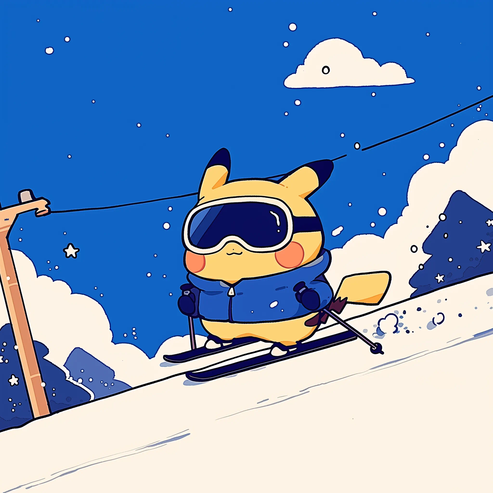

<style>
html, body {
  margin: 0;
  padding: 0;
  height: 100%;
  font-family: 'Segoe UI', 'Helvetica Neue', Arial, sans-serif;
  background-color: #f3f4f6 !important; 
}

body > div,
.main-container,
.page,
.page-header,
div#content {
  background-color: #f3f4f6 !important;  
  box-shadow: none !important;
  border: none !important;
}

.main-container {
  max-width: 100% !important;
  padding: 0 !important;
  margin: 0 !important;
}


/* ##############################   part 1  ################################ */
/* Hero */
.fullscreen-bg {
  background-image: url("website_image/electricity_background_origin.png");
  background-size: cover;      
  background-position: center;
  background-repeat: no-repeat;
  
  height: 100vh;     
  width: 100%;        
  
  display: flex;
  justify-content: center;
  align-items: center;
  text-align: center;
  
  color: white;
  text-shadow: 2px 2px 10px rgba(0,0,0,0.8);
}

/* the movement of the title */
.bg-title {
  font-size: 4em;
  font-weight: bold;
  letter-spacing: 6px;

  opacity: 0;
  animation: fade-in-title 2.5s ease-out forwards;
}

/* stay the position */
@keyframes fade-in-title {
  from { opacity: 0; }
  to   { opacity: 1; }
}

/* #########################   part 2 project overview  ######################### */

.cards-container {
  max-width: 1200px;
  margin: 80px auto;
  padding: 0 20px;
}

.section-title {
  text-align: center;
  font-size: 2.5em;
  color: #2c3e50;
  margin-bottom: 50px;
  font-weight: 700;
}

.cards-grid {
  display: grid;
  grid-template-columns: repeat(auto-fit, minmax(280px, 1fr));
  gap: 30px;
}

.card {
  background-color: #f5f5f5;
  border-radius: 16px;
  box-shadow: 0 10px 30px rgba(0, 0, 0, 0.08);
  overflow: hidden;
  cursor: pointer;
  transition: all 0.4s cubic-bezier(0.175, 0.885, 0.32, 1.1);
  border: 1px solid rgba(0, 0, 0, 0.05);
}

.card:hover {
  transform: translateY(-10px);
  box-shadow: 0 15px 35px rgba(0, 0, 0, 0.12);
}

.card-header {
  padding: 30px 25px;
  display: flex;
  align-items: center;
  justify-content: space-between;
}

.card-icon {
  font-size: 2.8em;
  margin-right: 20px;
  flex-shrink: 0;
}

.card-title-wrapper {
  flex-grow: 1;
}

.card-title {
  font-size: 1.8em;
  font-weight: 700;
  color: #2c3e50;
  margin-bottom: 8px;
}

.card-subtitle {
  font-size: 1em;
  color: #7f8c8d;
  font-weight: 500;
}

.card-toggle {
  color: #3498db;
  font-size: 1.8em;
  font-weight: 300;
  transition: transform 0.4s ease;
}

/* 卡片内容区域 */
.card-content {
  padding: 0 25px;
  max-height: 0;
  opacity: 0;
  overflow: hidden;
  transition: all 0.5s ease;
  border-top: 1px solid #eee;
}

.card.active {
  box-shadow: 0 15px 40px rgba(0, 0, 0, 0.15);
}

.card.active .card-content {
  padding: 0 25px 30px;
  max-height: 500px;
  opacity: 1;
  margin-top: 20px;
}

.card.active .card-toggle {
  transform: rotate(180deg);
}

@media (max-width: 768px) {
  .cards-container {
    margin: 50px auto;
  }
  .section-title {
    font-size: 2em;
  }
  .cards-grid {
    grid-template-columns: 1fr;
    gap: 20px;
  }
  .card-header {
    padding: 20px;
  }
}


/* ##############################   part 3  ################################ */
.normal-content {
  background-color: white;    
  color: black;               
  min-height: 100vh;        
  padding: 50px 20px;        
  font-size: 1.2em;          
  line-height: 1.6;           

  max-width: 1100px;
  margin: 0 auto;
}

/* video size */
.video-container {
  position: relative;
  width: 100%;
  max-width: 800px;
  margin: 30px auto;
  overflow: hidden;
}

/* 16:9 */
.video-container::before {
  content: "";
  display: block;
  padding-top: 56.25%;
}

/* iframe video itself */
.video-container iframe {
  position: absolute;
  top: 0;
  left: 0;
  width: 100%;
  height: 100%;
  border: none;
  border-radius: 8px;
  box-shadow: 0 4px 12px rgba(0, 0, 0, 0.15);
}

/* discription type */
.video-container + p {
  font-style: italic;
  color: #666;
  text-align: center;
  margin-bottom: 50px;
  font-size: 700;
}


/* ##############################   part 5  ################################ */


.team-fullscreen {
  width: 100vw; 
  margin-left: calc(50% - 50vw);
  margin-right: calc(50% - 50vw);
  background-color: #000000;   
  color: #e5e7eb;
  padding: 80px 20px 110px 20px;
}

.team-inner2 {
  max-width: 1100px;
  margin: 0 auto;
  text-align: center;
}

.team-title2 {
  font-size: 2.4em;
  font-weight: 700;
  margin-bottom: 40px;
  color: #ffffff;
}

.team-grid2 {
  display: flex;
  flex-wrap: wrap;
  justify-content: center;
  gap: 30px;
}

.team-member2 {
  width: 220px;
}

.team-card2 {
  background: radial-gradient(circle at top, rgba(148,163,184,0.18), rgba(15,23,42,0.95));
  border-radius: 20px;
  padding: 22px 18px 18px 18px;
  box-shadow: 0 18px 45px rgba(0,0,0,0.6);
  border: 1px solid rgba(148,163,184,0.35);
  transition: transform 0.28s ease, box-shadow 0.28s ease, border-color 0.28s ease;
}

.team-card2:hover {
  transform: translateY(-8px);
  box-shadow: 0 26px 60px rgba(0,0,0,0.8);
  border-color: #60a5fa;
}

.team-avatar2 {
  width: 110px;
  height: 110px;
  border-radius: 50%;
  object-fit: cover;
  border: 3px solid #f9fafb;
  margin: 0 auto 12px auto;
  display: block;
}

.team-name2 a {
  color: #f9fafb;
  font-weight: 650;
  font-size: 1.05em;
  text-decoration: none;
}

.team-name2 a:hover {
  color: #60a5fa;
}


/* ##############################   style end  ################################ */

</style>


<!-- ===============  part1: Hero =============== -->

<div class="fullscreen-bg">
  <div class="bg-title">Energy Insecurity and General Health Status</div>
</div>
<br>
<br>
<br>
<br>
<br>

<!-- =============== part2: motivation =============== -->
<p style="text-align:center;">
  <span style="font-size: 40px; font-weight: 800;">
    Introduction
  </span>
</p>
<div style="display:flex; justify-content:center;">

<table style="margin: auto; width: 80%; max-width: 1000px;">
  <tr>
    
    <!-- paragraph -->
    <td style="width:55%; padding:20px; vertical-align:top; 
               font-size:1.15em; line-height:1.7;">
       <br>
    This project is motivated by a central question: **how do household energy challenges influence general health status across U.S. communities?** Energy insecurity — from difficulty affording utilities to living in unsafe indoor temperatures — can create chronic stress and shape overall wellbeing. Understanding this relationship is important for recognizing energy access not just as an economic issue, but as a meaningful public health concern.
    We include two related indicators, **Energy Insecurity (EI)** and **extended Power Outages (PO)**, to help illustrate how energy vulnerability varies across states.
    Below, an interactive map allows you to explore EI and PO patterns across the United States.
    </td>

    <!-- image on the right -->
    <td style="width:75%; padding:30px; vertical-align:top; text-align:center;">
      
    </td>

  </tr>
</table>

</div>


<!-- ================================ map ================================ -->

```{r interactive-map, echo=FALSE, message=FALSE, warning=FALSE}
library(tidyverse)
library(sf)
library(tigris)
library(leaflet)
library(scales)
library(glue)
library(htmltools) 

options(tigris_use_cache = TRUE)  

recs = read.csv("EDA/clean data/RECS_Energy_insecurity.csv")
states_sf <- states(cb = TRUE, class = "sf") |> 
  filter(!STUSPS %in% c("AS", "GU", "MP", "PR", "VI"))

map_data = states_sf |> 
  left_join(recs, by = c("NAME" = "state"))

pal_po <- colorNumeric(
  palette  = "YlOrRd",
  domain   = map_data$PO_proportion,
  na.color = "transparent"
)

pal_ei <- colorNumeric(
  palette  = "Blues",
  domain   = map_data$EI_proportion,
  na.color = "transparent"
)

labels_PO <- map_data |>
  mutate(
    lab = glue(
      "{NAME}<br>",
      "PO_number: {PO_number}<br>",
      "PO_proportion: {percent(PO_proportion, accuracy = 0.1)}"
    )
  ) |>
  pull(lab) |>
  lapply(htmltools::HTML) 

labels_EI <- map_data |>
  mutate(
    lab = glue(
      "{NAME}<br>",
      "EI_number: {EI_number}<br>",
      "EI_proportion: {percent(EI_proportion, accuracy = 0.1)}"
    )
  ) |>
  pull(lab) |>
  lapply(htmltools::HTML)

legend_PO_html <- HTML(glue("
  <div id='legendPO' style='background: white; padding: 8px; border-radius: 4px;'>
    <b>PO proportion</b><br>
    <i style='background: #ffffb2; width: 18px; height: 10px; display:inline-block;'></i> Low<br>
    <i style='background: #fecc5c; width: 18px; height: 10px; display:inline-block;'></i> Medium<br>
    <i style='background: #e31a1c; width: 18px; height: 10px; display:inline-block;'></i> High
  </div>
"))

legend_EI_html <- HTML(glue("
  <div id='legendEI' style='background: white; padding: 8px; border-radius: 4px; display:none;'>
    <b>EI proportion</b><br>
    <i style='background: #deebf7; width: 18px; height: 10px; display:inline-block;'></i> Low<br>
    <i style='background: #9ecae1; width: 18px; height: 10px; display:inline-block;'></i> Medium<br>
    <i style='background: #3182bd; width: 18px; height: 10px; display:inline-block;'></i> High
  </div>
"))

m <- leaflet(map_data) |>
  addTiles() |>
  setView(lng = -98.5, lat = 39.8, zoom = 4) |>
  addPolygons(
    fillColor   = ~pal_po(PO_proportion),
    color       = "white",
    weight      = 1,
    opacity     = 1,
    fillOpacity = 0.7,
    label       = labels_PO,   
    labelOptions = labelOptions(
      style = list(
        "font-size" = "12px",
        "background" = "rgba(255,255,255,0.85)"
      ),
      direction = "auto"
    ),
    group = "PO proportion"
  ) |>
  addPolygons(
    fillColor   = ~pal_ei(EI_proportion),
    color       = "white",
    weight      = 1,
    opacity     = 1,
    fillOpacity = 0.7,
    label       = labels_EI,   
    labelOptions = labelOptions(
      style = list(
        "font-size" = "12px",
        "background" = "rgba(255,255,255,0.85)"
      ),
      direction = "auto"
    ),
    group = "EI proportion"
  ) |>
  addLayersControl(
    baseGroups = c("PO proportion", "EI proportion"),
    options    = layersControlOptions(collapsed = FALSE)
  ) |>
  addControl(legend_PO_html, position = "bottomright") |>
  addControl(legend_EI_html, position = "bottomright")

m <- htmlwidgets::onRender(
  m,
  "
  function(el, x) {
    var map = this;
    map.on('baselayerchange', function(e) {
      if (e.name === 'PO proportion') {
        document.getElementById('legendPO').style.display = 'block';
        document.getElementById('legendEI').style.display = 'none';
      }
      if (e.name === 'EI proportion') {
        document.getElementById('legendPO').style.display = 'none';
        document.getElementById('legendEI').style.display = 'block';
      }
    });
  }
  "
)
htmltools::div(
  style="
    max-width: 800px; width: 90%; margin: 40px auto;
    background:white; padding:20px 25px;
    border-radius:12px; box-shadow:0 3px 12px rgba(0,0,0,0.08);
  ",
  htmltools::h3(
    "Interactive Energy Map",
    style="text-align:center; margin-top:0; font-weight:700;"
  ),
  htmltools::p(
    "Explore variation in energy insecurity (EI) and power outages (PO) across U.S. states.",
    style="text-align:center; color:#555; margin-top:-5px; font-weight:600;"
  ),
  m
)
```


<br>
<br>
<br>
<br>
<div class="cards-container">
<h2 class="section-title">Project Overview</h2>

<div class="cards-grid">

<!--------- Proposal -------->
<div class="card" onclick="toggleCard(this)">
<div class="card-header">
<div style="display: flex; align-items: center;">
<div class="card-icon"><i class="fa-solid fa-file-lines"></i></div>
<div class="card-title-wrapper">
<div class="card-title">Proposal</div>
<div class="card-subtitle">Research Plan & Objectives</div>
</div>
</div>
<div class="card-toggle">⌄</div>
</div>
<div class="card-content">
<p>Our project begins with a clear research proposal outlining the key questions and scope.</p>
<ul>
<li><strong>Objective:</strong> To investigate the relationship between electricity insecurity and general health status.</li>
<li><strong>Hypothesis:</strong> Regions with unstable electricity supply may show higher incidence of specific health issues.</li>
<li><strong>Methodology:</strong> A statisitcal method on a quantitative analysis.</li>
</ul>
<p style="text-align:right; margin-top:15px;">
  <a href="Proposal.html" style="color:#3498db; font-weight:600; text-decoration:none;">
    Learn More →
  </a>
</p>
</div>
</div>


<!-------- Data -------->
<div class="card" onclick="toggleCard(this)">
<div class="card-header">
<div style="display: flex; align-items: center;">
<div class="card-icon"><i class="fa-solid fa-database"></i>️</div>
<div class="card-title-wrapper">
<div class="card-title">Data</div>
<div class="card-subtitle">Collection & Processing</div>
</div>
</div>
<div class="card-toggle">⌄</div>
</div>
<div class="card-content">
<p>We gather and clean data from multiple sources to build a reliable dataset.</p>
<ul>
<li><strong>Sources:</strong> Energy records, public health databases.</li>
<li><strong>Key variables:</strong> Energy insecurity conditions and general health status outcomes.</li>
<li><strong>Tools:</strong> R for data wrangling and integration.</li>
</ul>
<p style="text-align:right; margin-top:15px;">
  <a href="data.html" style="color:#3498db; font-weight:600; text-decoration:none;">
    Learn More →
  </a>
</p>

</div>
</div>

<!------- EDA ------->
<div class="card" onclick="toggleCard(this)">
<div class="card-header">
<div style="display: flex; align-items: center;">
<div class="card-icon"><i class="fa-solid fa-magnifying-glass-chart"></i></div>
<div class="card-title-wrapper">
<div class="card-title">EDA</div>
<div class="card-subtitle">Exploratory Analysis</div>
</div>
</div>
<div class="card-toggle">⌄</div>
</div>
<div class="card-content">
<p>We explore the data visually and statistically to identify patterns and anomalies.</p>
<ul>
<li><strong>Techniques:</strong> Summary statistics, correlations, and components comparisons.</li>
<li><strong>Visualization:</strong> Scatter plots, maps, and distribution charts.</li>
</ul>
<p style="text-align:right; margin-top:15px;">
  <a href="EDA.html" style="color:#3498db; font-weight:600; text-decoration:none;">
    Learn More →
  </a>
</p>
</div>
</div>


<!--------- Regression --------->
<div class="card" onclick="toggleCard(this)">
<div class="card-header">
<div style="display: flex; align-items: center;">
<div class="card-icon"><i class="fa-solid fa-chart-line"></i></div>
<div class="card-title-wrapper">
<div class="card-title">Regression</div>
<div class="card-subtitle">Statistical Modeling</div>
</div>
</div>
<div class="card-toggle">⌄</div>
</div>
<div class="card-content">
<p>We build models to formally quantify the relationships in the data.</p>
<ul>
<li><strong>Approaches:</strong> Regression models, multivariable analysis.</li>
<li><strong>Validation:</strong> Train/test splits and cross-validation to assess performance.</li>
<li><strong>Focus:</strong> understand whether and how energy insecurity contributes to poorer health outcomes, and which variables most strongly influence these relationships.</li>
</ul><p style="text-align:right; margin-top:15px;">
  <a href="Regression_analysis.html" style="color:#3498db; font-weight:600; text-decoration:none;">
    Learn More →
  </a>
</p>
</div>
</div>


<!----------- Report ---------->
<div class="card" onclick="toggleCard(this)">
<div class="card-header">
<div style="display: flex; align-items: center;">
<div class="card-icon"><i class="fa-solid fa-file-contract"></i></div>
<div class="card-title-wrapper">
<div class="card-title">Report</div>
<div class="card-subtitle">Communication & Reflection</div>
</div>
</div>
<div class="card-toggle">⌄</div>
</div>
<div class="card-content">
<p>The final report presents a clear narrative of our project, summarizing the motivation, methods, results, and key insights that link energy insecurity to general health status outcomes across the U.S.</p>
<p style="text-align:right; margin-top:15px;">
  <a href="Report_V4.html" style="color:#3498db; font-weight:600; text-decoration:none;">
    Learn More →
  </a>
</p>

</div>
</div>

<!---------- 6: Shiny -------->
<div class="card" onclick="toggleCard(this)">
<div class="card-header">
<div style="display: flex; align-items: center;">
<div class="card-icon"><i class="fa-solid fa-chart-column"></i></div>
<div class="card-title-wrapper">
<div class="card-title">Shiny</div>
<div class="card-subtitle">Key Findings</div>
</div>
</div>
<div class="card-toggle">⌄</div>
</div>
<div class="card-content">
<p>The Shiny app offers an interactive way to explore the data and results, allowing users to visualize patterns, compare states, and engage with the findings in a more intuitive format.</p>

<p style="text-align:right; margin-top:15px;">
  <a href="https://haoyang.shinyapps.io/shiny/" style="color:#3498db; font-weight:600; text-decoration:none;">
    Learn More →
  </a>
</p>
</div>
</div>

</div>
</div>


<script>
function toggleCard(cardElement) {
  if (cardElement.classList.contains('active')) {
    cardElement.classList.remove('active');
  } else {
    const allCards = document.querySelectorAll('.card');
    allCards.forEach(card => {
      card.classList.remove('active');
    });
    cardElement.classList.add('active');
  }
}

document.addEventListener('keydown', function(event) {
  if (event.key === 'Escape') {
    const allCards = document.querySelectorAll('.card');
    allCards.forEach(card => {
      card.classList.remove('active');
    });
  }
});
</script>

<!-- =============== part 4 video =============== 
<br>
<br>
<br>
<br>
<div style="text-align:center; margin: 30px auto; max-width: 900px;" markdown="1">
<h2 class="section-title">🎬 Video Overview</h2>
We created a short video to provide an overview of our project and help viewers quickly understand its main goals, methods, results and insights. This visual summary offers a clear and engaging way to explore the key concepts behind our work, making the project more accessible to a wider audience.
</div>
<div class="video-container">
  <iframe 
    src="https://www.youtube.com/embed/VIDEO_ID" 
    title="YouTube video player" 
    frameborder="0" 
    allow="accelerometer; autoplay; clipboard-write; encrypted-media; gyroscope; picture-in-picture" 
    allowfullscreen>
  </iframe>
</div>-->


<!-- ============================= group member ============================ -->
<br>
<br>
<br>
<br>
<br>
<br>

<div class="team-fullscreen">
<div class="team-inner2">
<div class="team-title2">Our Team</div>
<div class="team-grid2">

<div class="team-member2">
<div class="team-card2">

<div class="team-name2">  
<a href=mailto:ll3968@cumc.columbia.edu target="_blank">Liutong Li</a>
</div>
</div>
</div>

<div class="team-member2">
<div class="team-card2">

<div class="team-name2">
<a href=mailto:bz2561@cumc.columbia.edu target="_blank">Bohan Zhu</a>
</div>
</div>
</div>

<div class="team-member2">
<div class="team-card2">

<div class="team-name2">
<a href=mailto:yd2868@cumc.columbia.edu target="_blank">Yuanbo Dai</a>
</div>
</div>
</div>

<div class="team-member2">
<div class="team-card2">

<div class="team-name2">
<a href=mailto:hc3671@cumc.columbia.edu target="_blank">Haoyang Chen</a>
</div>
</div>
</div>

</div>
</div>
</div>

<p style="text-align:center; margin-top:50px; color:#4b5563; font-size:1.0em; letter-spacing:0.3px;">
  Feel free to contact us
  </a>
</p>
<br>
<br>


