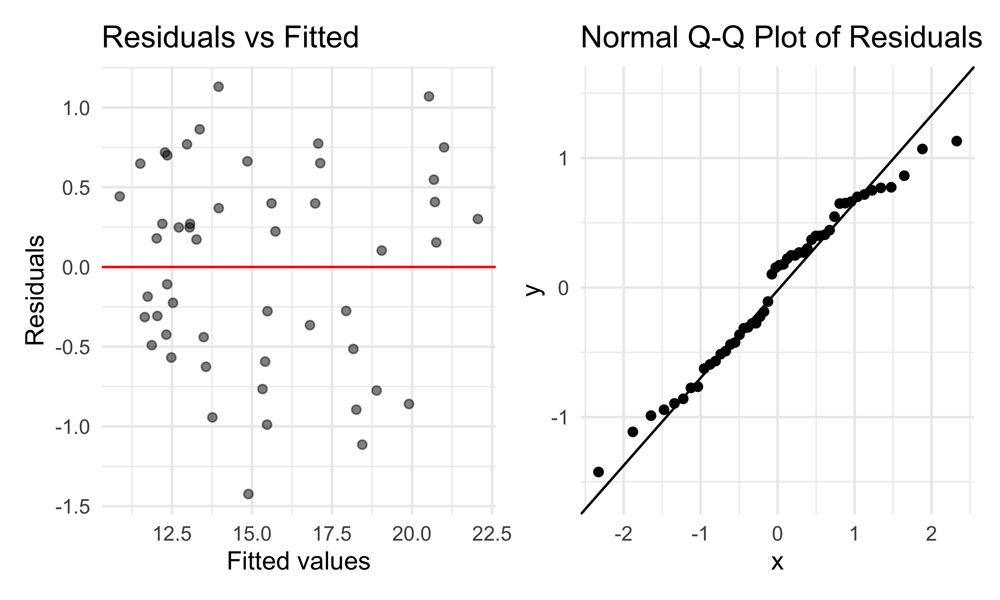

regression_analysis
================

To build the regression model, I included `mean_mhlth`,
`mean_depression`, `mean_access`, `mean_smoking`, `mean_binge`,
`mean_sleep`, `mean_lpa`, `mean_diabetes`, `mean_bphigh`,
`EI_proportion`, and `PO_proportion` because they represent key
dimensions of community health, health behaviors, access to care, and
socioeconomic conditions that are plausibly related to overall general
health. Using these variables together helps capture multiple pathways
influencing the outcome and reduces the risk of omitted-variable bias
while improving the model’s explanatory power.

### Multiple Linear Regression

Fit the model

``` r
mlr_fit =
  lm(mean_glth ~ mean_mhlth + mean_depression + mean_access +
       mean_smoking + mean_binge + mean_sleep + mean_lpa +
       mean_diabetes + mean_bphigh + EI_proportion + PO_proportion,
     data = regression_data)

summary(mlr_fit) |> 
  broom::tidy(conf.int = TRUE) |> 
  select(term, estimate, conf.low, conf.high, p.value) |> 
  knitr::kable(digits = 3)
```

| term            | estimate | conf.low | conf.high | p.value |
|:----------------|---------:|---------:|----------:|--------:|
| (Intercept)     |   -6.425 |  -10.977 |    -1.873 |   0.007 |
| mean_mhlth      |    0.558 |    0.263 |     0.854 |   0.000 |
| mean_depression |    0.008 |   -0.134 |     0.149 |   0.914 |
| mean_access     |    0.029 |   -0.041 |     0.099 |   0.413 |
| mean_smoking    |   -0.021 |   -0.172 |     0.130 |   0.780 |
| mean_binge      |    0.004 |   -0.101 |     0.109 |   0.939 |
| mean_sleep      |   -0.101 |   -0.225 |     0.024 |   0.110 |
| mean_lpa        |    0.224 |    0.080 |     0.369 |   0.003 |
| mean_diabetes   |    0.671 |    0.287 |     1.055 |   0.001 |
| mean_bphigh     |    0.033 |   -0.111 |     0.178 |   0.643 |
| EI_proportion   |   12.789 |    5.606 |    19.971 |   0.001 |
| PO_proportion   |   -2.130 |   -4.270 |     0.011 |   0.051 |

Check for key assumptions

``` r
p1 =
  regression_data |>
  modelr::add_residuals(mlr_fit) |>
  modelr::add_predictions(mlr_fit) |>
  ggplot(aes(x = pred, y = resid)) +
  geom_point(alpha = 0.5) +
  geom_hline(yintercept = 0, color = "red") +
  labs(x = "Fitted values", y = "Residuals",
       title = "Residuals vs Fitted")

p2 =
  ggplot(mlr_fit, aes(sample = .resid)) +
  stat_qq() +
  stat_qq_line() +
  labs(title = "Normal Q-Q Plot of Residuals")

p1 + p2
```



The residuals appear randomly scattered around zero without a clear
pattern, suggesting that the linearity and constant variance assumptions
are reasonably satisfied.

Most points fall close to the reference line, indicating that the
residuals are approximately normally distributed. A few deviations at
the tails are expected with small samples (n = 50), but overall the
normality assumption is acceptable.

After fitting the MLR model, we apply stepwise selection to efficiently
identify the most informative predictors while keeping the key
electricity variables in the model.

``` r
lower_model =
  lm(mean_glth ~ EI_proportion + PO_proportion,
     data = regression_data)

step_model =
  step(mlr_fit,
       scope = list(lower = formula(lower_model),
                    upper = formula(mlr_fit)),
       direction = "both",
       trace = FALSE)

summary(step_model) |>
  broom::tidy(conf.int = TRUE) |>
  select(term, estimate, conf.low, conf.high, p.value) |>
  knitr::kable(digits = 3)
```

| term          | estimate | conf.low | conf.high | p.value |
|:--------------|---------:|---------:|----------:|--------:|
| (Intercept)   |   -5.635 |   -8.222 |    -3.049 |   0.000 |
| mean_mhlth    |    0.556 |    0.386 |     0.725 |   0.000 |
| mean_sleep    |   -0.115 |   -0.215 |    -0.015 |   0.025 |
| mean_lpa      |    0.226 |    0.122 |     0.330 |   0.000 |
| mean_diabetes |    0.744 |    0.460 |     1.027 |   0.000 |
| EI_proportion |   13.841 |    7.566 |    20.116 |   0.000 |
| PO_proportion |   -2.102 |   -3.984 |    -0.221 |   0.029 |

The final model based on MLR results in:

### ELASTIC NET

Because our EDA shows that the two electricity variables are strongly
correlated, the MLR model is likely to produce unstable estimates. Using
Elastic Net helps prevent overfitting while simultaneously stabilizing
the coefficient estimates and shrinking unnecessary parameters toward
zero. Hence, we expec that this may leads to a more robust and
interpretable model.

We set $\alpha = 0.5$ to balance the Ridge and Lasso penalties within
the Elastic Net framework. We then used `cv.glmnet()` to identify the
optimal value of $\lambda$. This function performs 10-fold
cross-validation by default, repeatedly splitting the data into ten
parts, training the model on nine parts, and validating it on the
remaining part to select the $\lambda$ that minimizes the
cross-validated error

``` r
y <- regression_data$mean_glth

X <- regression_data |> 
  select(
    mean_mhlth, mean_depression, mean_access, mean_smoking,
    mean_binge, mean_sleep, mean_lpa, mean_diabetes, mean_bphigh,
    EI_proportion, PO_proportion
  ) |> 
  as.matrix()

cv_en <- cv.glmnet(X, y, alpha = 0.5)
lambda_best <- cv_en$lambda.min
fit_en <- glmnet(X, y, alpha = 0.5, lambda = lambda_best)

coef_en <- coef(fit_en)
coef_en
```

    ## 12 x 1 sparse Matrix of class "dgCMatrix"
    ##                           s0
    ## (Intercept)     -7.217287806
    ## mean_mhlth       0.487334980
    ## mean_depression  0.004961792
    ## mean_access      0.045936144
    ## mean_smoking     0.027022483
    ## mean_binge       .          
    ## mean_sleep       .          
    ## mean_lpa         0.193657398
    ## mean_diabetes    0.534606842
    ## mean_bphigh      0.032181274
    ## EI_proportion   10.817492000
    ## PO_proportion   -0.819165535

``` r
pred_en <- predict(fit_en, X) |> as.numeric()

r2_en <- 1 - sum((y - pred_en)^2) / sum((y - mean(y))^2)
r2_en
```

    ## [1] 0.9567934

``` r
rmse_en <- sqrt(mean((y - pred_en)^2))
rmse_en
```

    ## [1] 0.6592415

### Bootstrap

After fitting the MLR model, we applied the bootstrap to evaluate how
stable our results are under repeated sampling. The usual regression
output relies on assumptions such as normality and constant variance,
which may not fully hold in our data. Bootstrap resampling lets us
approximate the sampling distribution of key estimates directly from the
data, providing more robust standard errors and confidence intervals.
This helps us assess whether the model’s conclusions remain consistent
across resampled datasets.

``` r
boot_straps =
  regression_data |>
  modelr::bootstrap(n = 5000)

boot_results =
  boot_straps |>
  mutate(
    models = map(
      strap,
      \(df) lm(
        mean_glth ~ mean_mhlth + mean_depression + mean_access +
                    mean_smoking + mean_binge + mean_sleep + mean_lpa +
                    mean_diabetes + mean_bphigh + EI_proportion + PO_proportion,
        data = df
      )
    ),
    results = map(models, broom::tidy)
  ) |>
  select(-strap, -models) |>
  unnest(results) |> 
  select(term, estimate, p.value)


boot_se =
  boot_results |>
  group_by(term) |>
  summarize(boot_se = sd(estimate))

boot_se
```

    ## # A tibble: 12 × 2
    ##    term            boot_se
    ##    <chr>             <dbl>
    ##  1 (Intercept)      2.55  
    ##  2 EI_proportion    4.21  
    ##  3 PO_proportion    0.958 
    ##  4 mean_access      0.0363
    ##  5 mean_binge       0.0558
    ##  6 mean_bphigh      0.0837
    ##  7 mean_depression  0.0757
    ##  8 mean_diabetes    0.189 
    ##  9 mean_lpa         0.0894
    ## 10 mean_mhlth       0.169 
    ## 11 mean_sleep       0.0816
    ## 12 mean_smoking     0.0859

### Cross Validation
